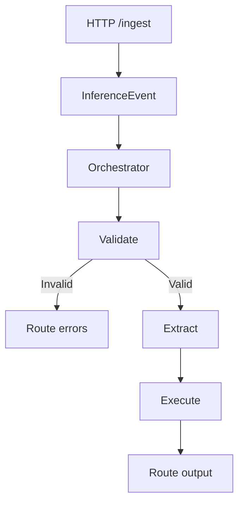

# FnCast (.NET 8)


FnCast-dotNet is a clean, modular, cloud-ready C# implementation of an event-driven inference pipeline. It modernizes the original Python FnCast design using .NET 8 and Clean Architecture.

## Architecture

- **Domain**: Core models (`InferenceEvent`, `ValidationResult`, `InferenceResult`). No external dependencies.
- **Application**: Interfaces and orchestrator (`IPipelineOrchestrator`) coordinating stages via DI and async/await.
- **Infrastructure**: Concrete implementations for validation, metadata extraction, inference, and output routing.
- **Api**: Minimal API ingestion endpoint, DI configuration, logging, and app settings.
- **Tests**: xUnit tests for the orchestrator and validation/inference paths.

### Diagrams
See detailed flowcharts in [docs/diagrams.md](docs/diagrams.md). A condensed Minimal API flow:



### Pipeline Stages
1. Event ingestion (HTTP POST `/ingest`)
2. Payload validation (JSON well-formed check when content type includes `json`)
3. Metadata extraction (basic fields like `eventId`, `timestamp`, optional `correlationId`, `source`)
4. Inference execution (placeholder text transform: Uppercase/Lowercase/Echo)
5. Output routing (logging)

## Minimal APIs vs Azure Functions

This starter uses **Minimal APIs** for simplicity, portability, and rapid local iteration:
- Pros: Fast startup, fewer moving parts, easy to containerize and run anywhere.
- Cons: You implement triggers/endpoints yourself; platform-native bindings not included by default.

If you prefer serverless triggers and platform bindings, swapping `Api` for **Azure Functions** is straightforward: reuse Domain/Application/Infrastructure and wire functions to call `IPipelineOrchestrator`. Functions give native triggers (HTTP, Queue, Event Grid) and scaling. Minimal APIs are great for cloud-agnostic deployments or when you want a simple HTTP surface.

## Getting Started

### Prerequisites
- .NET 8 SDK

### Build & Test
```bash
dotnet build FnCast.sln
dotnet test FnCast.sln
```

### Run the API
```bash
dotnet run --project src/Api/FnCast.Api.csproj
```

Send an event:
```bash
curl -sS http://localhost:5097/ingest \
	-H "Content-Type: application/json" \
	-d '{"payload":"hello world","contentType":"text/plain"}'
```

Note: The port may vary when using `dotnet run`. To fix a port, set `ASPNETCORE_URLS`:
- Bash:
	```bash
	ASPNETCORE_URLS=http://localhost:5097 dotnet run --project src/Api/FnCast.Api.csproj
	```
- PowerShell:
	```powershell
	$env:ASPNETCORE_URLS = 'http://localhost:5097'
	dotnet run --project src/Api/FnCast.Api.csproj
	```

Configuration in [src/Api/appsettings.json](src/Api/appsettings.json):
- `Inference.Mode`: `Uppercase` | `Lowercase` | `Echo`
- Logging levels via `Logging`

### Quick Start (Windows curl.exe)

- PowerShell (ensure you call `curl.exe` and not the alias):
	```powershell
	$env:ASPNETCORE_URLS = 'http://localhost:5097'
	dotnet run --project src/Api/FnCast.Api.csproj
	# new shell
	curl.exe -sS "http://localhost:5097/ingest" -H "Content-Type: application/json" -d "{\"payload\":\"hello world\",\"contentType\":\"text/plain\"}"
	```
- CMD:
	```cmd
	set ASPNETCORE_URLS=http://localhost:5097
	dotnet run --project src\Api\FnCast.Api.csproj
	:: new window
	curl.exe -sS "http://localhost:5097/ingest" -H "Content-Type: application/json" -d "{\"payload\":\"hello world\",\"contentType\":\"text/plain\"}"
	```

### Run with Docker

Build and run the API container:
```bash
docker build -f src/Api/Dockerfile -t fncast-dotnet .
docker run --rm -p 8080:8080 fncast-dotnet
```

Then POST to `http://localhost:8080/ingest` as above.

### Postman Collection

Import the collection at [docs/postman/fncast.postman_collection.json](docs/postman/fncast.postman_collection.json) and set the `baseUrl` variable to your running host (e.g., `http://localhost:5097` or `http://localhost:8080`). It includes:
- `GET /health`
- `POST /ingest` examples for `text/plain` and `application/json` payloads.

### One-Click Requests (VS Code)

- Use [docs/requests.http](docs/requests.http) with the REST Client extension (recommended via [.vscode/extensions.json](.vscode/extensions.json)).
- The file defines `@baseUrl` you can switch between API (`5097`) and Docker (`8080`).

### .env Example

- See [.env.example](.env.example) for suggested local environment variables:
	- `ASPNETCORE_URLS=http://localhost:5097` to fix the port
	- `Inference__Mode=Uppercase` to configure the inference placeholder
- Note: .NET does not auto-load `.env`; set environment variables in your shell or configure in appsettings.

### Azure Functions (optional)

An Azure Functions (isolated worker) project is provided in [src/Functions](src/Functions) with:
- `HttpIngestFunction` (HTTP POST trigger) and `QueueIngestFunction` (Azure Storage Queue trigger).
- DI and configuration in [src/Functions/Program.cs](src/Functions/Program.cs) using the same orchestrator and infrastructure.
- Local settings in [src/Functions/local.settings.json](src/Functions/local.settings.json) and function host config in [src/Functions/host.json](src/Functions/host.json).

To run locally, install Azure Functions Core Tools and start:
```bash
func start --csharp
```
Note: Core Tools is required for local execution; deployment targets can use Azure Functions with the same code.

#### One-Click Requests for Functions
- Use [docs/requests-functions.http](docs/requests-functions.http) (REST Client) to call `HttpIngest` locally at `http://localhost:7071/api/HttpIngest`.

## CI

GitHub Actions workflow at [.github/workflows/ci.yml](.github/workflows/ci.yml) runs restore, build, and tests on Ubuntu and Windows; it also validates the Dockerfile by building the image.

### Deploy Functions via GitHub Actions

Workflow [.github/workflows/deploy-functions.yml](.github/workflows/deploy-functions.yml) deploys the Functions app on push to `main` when files under `src/Functions` change.

Setup required:
- Create an Azure Function App (see Bicep section) and note its name.
- Add repository variable `AZURE_FUNCTIONAPP_NAME` with the Function App name.
- Add repository secret `AZURE_FUNCTIONAPP_PUBLISH_PROFILE` with the publish profile (download from the Function App in Azure Portal).

The workflow builds and publishes `src/Functions` and deploys the package to Azure.

## Deploy (Azure + Bicep)

Infra as code is provided in [infra/azure/main.bicep](infra/azure/main.bicep) with parameters in [infra/azure/main.bicepparam](infra/azure/main.bicepparam).

### Provision resources
```bash
# create a resource group
az group create -n fncast-dotnet-rg -l eastus

# deploy bicep (edit baseName/location as needed)
az deployment group create \
	-g fncast-dotnet-rg \
	-f infra/azure/main.bicep \
	-p baseName=fncastdotnet location=eastus
```

Outputs include the function app name and (optional) Event Grid topic info.

### Wire Event Grid to the function
The `EventGridIngest` function uses an Event Grid trigger. After deploying the function app code (e.g., `func azure functionapp publish <appName>` or CI/CD), create a subscription pointing to the function endpoint:

```bash
# get function key (requires Azure CLI extension support)
az functionapp function keys list \
	--function-name EventGridIngest \
	--name <functionAppName> \
	--resource-group fncast-dotnet-rg

# create an event subscription to the custom topic
az eventgrid event-subscription create \
	--source-resource-id \
		"/subscriptions/<subId>/resourceGroups/fncast-dotnet-rg/providers/Microsoft.EventGrid/topics/<topicName>" \
	--name fncast-eg-sub \
	--endpoint \
		"https://<functionAppName>.azurewebsites.net/runtime/webhooks/EventGrid?functionName=EventGridIngest&code=<functionKey>"
```

Alternatively, publish events to the topic and verify the function logs to confirm end-to-end ingestion.
#### Quick Wire-Up (using deployment outputs)
If you captured your deployment name, you can query outputs and create the Event Grid subscription quickly:

```bash
# replace with your resource group and deployment name
RG=fncast-dotnet-rg
DEPLOYMENT_NAME=<your-deployment-name>

# get outputs (requires jq)
FUNC_APP=$(az deployment group show -g "$RG" -n "$DEPLOYMENT_NAME" --query properties.outputs.functionAppName.value -o tsv)
TOPIC_NAME=$(az deployment group show -g "$RG" -n "$DEPLOYMENT_NAME" --query properties.outputs.eventGridTopicName.value -o tsv)
TOPIC_ID=$(az eventgrid topic show -g "$RG" -n "$TOPIC_NAME" --query id -o tsv)

# get function key
FUNC_KEY=$(az functionapp function keys list --function-name EventGridIngest --name "$FUNC_APP" --resource-group "$RG" --query default -o tsv)

# create subscription
az eventgrid event-subscription create \
	--source-resource-id "$TOPIC_ID" \
	--name fncast-eg-sub \
	--endpoint "https://$FUNC_APP.azurewebsites.net/runtime/webhooks/EventGrid?functionName=EventGridIngest&code=$FUNC_KEY"
```

If you did not save the deployment name, you can still retrieve the topic and function app names from the Azure Portal or via `az` and use the commands above.

#### Local Queues (Azurite)
For local testing of `QueueIngestFunction`, use Azurite and set `AzureWebJobsStorage` to `UseDevelopmentStorage=true` in [src/Functions/local.settings.json](src/Functions/local.settings.json).

```bash
# install azurite (node-based)
npm install -g azurite

# start azurite locally
azurite -l .azurite --silent --skipApiVersionCheck

# queue name used by the function
echo "Use queue: fncast-events"
```

Learn more: https://learn.microsoft.com/azure/storage/common/storage-use-azurite
### Producer Scripts (Event Grid & Queue)

Use the helper scripts in [docs/scripts](docs/scripts):
- Event Grid (publish to custom topic):
	- PowerShell:
		```powershell
		./docs/scripts/publish-eventgrid.ps1 -ResourceGroup fncast-dotnet-rg -TopicName fncastdotnet-topic -Subject demo -Data '{"message":"hello"}'
		```
	- Bash:
		```bash
		RESOURCE_GROUP=fncast-dotnet-rg TOPIC_NAME=fncastdotnet-topic SUBJECT=demo DATA='{ "message": "hello" }' ./docs/scripts/publish-eventgrid.sh
		```
- Storage Queue (send message to `fncast-events`):
	- PowerShell:
		```powershell
		./docs/scripts/publish-queue-message.ps1 -ResourceGroup fncast-dotnet-rg -StorageAccountName <name> -QueueName fncast-events -Message "hello"
		```
	- Bash:
		```bash
		RESOURCE_GROUP=fncast-dotnet-rg STORAGE_ACCOUNT_NAME=<name> QUEUE_NAME=fncast-events MESSAGE='hello' ./docs/scripts/publish-queue-message.sh
		```

Tip: You can also set `CONNECTION_STRING` directly (instead of RG+account) for queue scripts.

#### Troubleshooting
- Azure CLI: Ensure `az` is installed and you're logged in (`az login`). For Event Grid commands, install the extension: `az extension add --name eventgrid`.
- Permissions: Event Grid publish requires `EventGrid Data Sender` on the topic (or `Contributor` on the resource group). Storage Queue operations need appropriate RBAC or a valid `CONNECTION_STRING`.
- Function Keys: If `az functionapp function keys list` fails, retrieve the function key from the Azure Portal under your Function App → `EventGridIngest` → Keys.
- Local Queues: For local testing, use Azurite. Configure `AzureWebJobsStorage` in [src/Functions/local.settings.json](src/Functions/local.settings.json) and ensure the `QueueIngestFunction` listens on `fncast-events`.
- Topic/Endpoint: Verify `TopicName` and resource group match your deployment outputs from the Bicep deployment. Use `az eventgrid topic show -g <rg> -n <topic>` to confirm the endpoint.

## Folder Structure

```
src/
	Api/
		Contracts/
			IngestRequest.cs
			IngestResponse.cs
		Program.cs
		FnCast.Api.csproj
		appsettings.json
	Application/
		Abstractions/
			IEventValidator.cs
			IMetadataExtractor.cs
			IInferenceExecutor.cs
			IOutputRouter.cs
			IPipelineOrchestrator.cs
		PipelineOrchestrator.cs
		FnCast.Application.csproj
	Domain/
		Models/
			InferenceEvent.cs
			ValidationResult.cs
			InferenceResult.cs
		FnCast.Domain.csproj
	Infrastructure/
		Validation/JsonEventValidator.cs
		Metadata/BasicMetadataExtractor.cs
		Inference/PlaceholderInferenceExecutor.cs
		Routing/LoggingOutputRouter.cs
		Options/InferenceOptions.cs
		FnCast.Infrastructure.csproj
tests/
	FnCast.Tests/
		PipelineOrchestratorTests.cs
		FnCast.Tests.csproj
FnCast.sln
```

## Extensibility

This design supports future growth by isolating concerns behind interfaces:
- Swap inference engines by implementing `IInferenceExecutor` (e.g., ONNX, Torch, Azure/Foundry endpoints).
- Add new validators or metadata extractors without touching orchestrator.
- Route outputs to different sinks by implementing `IOutputRouter` (blob storage, queues, databases).
- Replace Minimal API with Azure Functions or other hosts while reusing Domain/Application/Infrastructure unchanged.
- Configuration is bound to options (`InferenceOptions`) enabling feature flags and tunables.

All public classes and methods include XML documentation comments to aid IDE/tooling and future maintainers.
