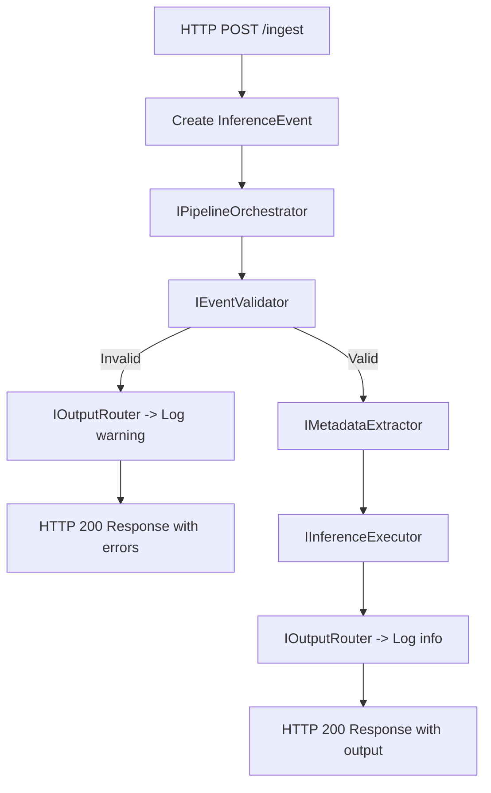
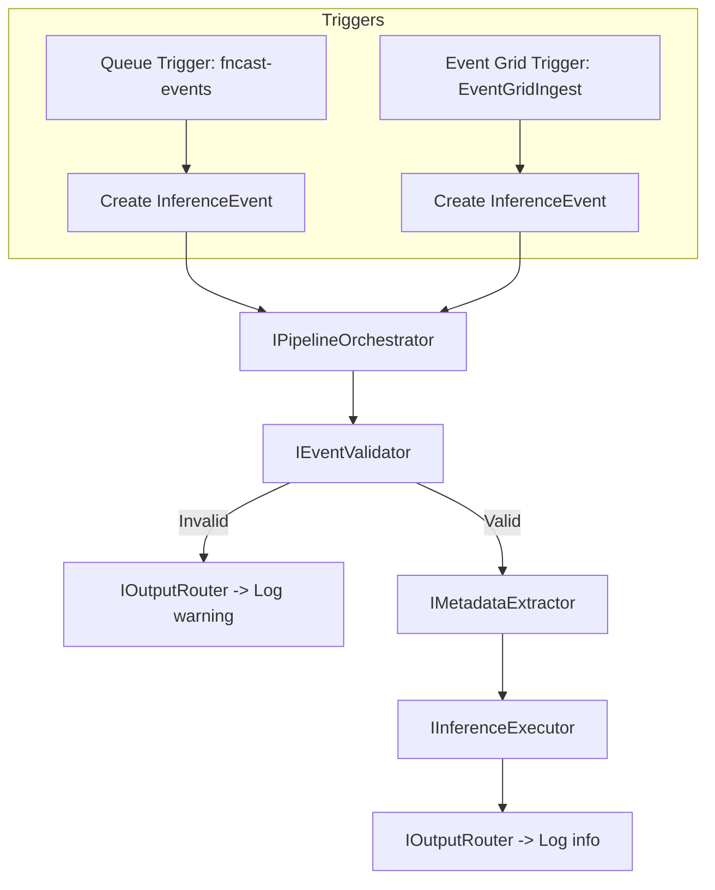
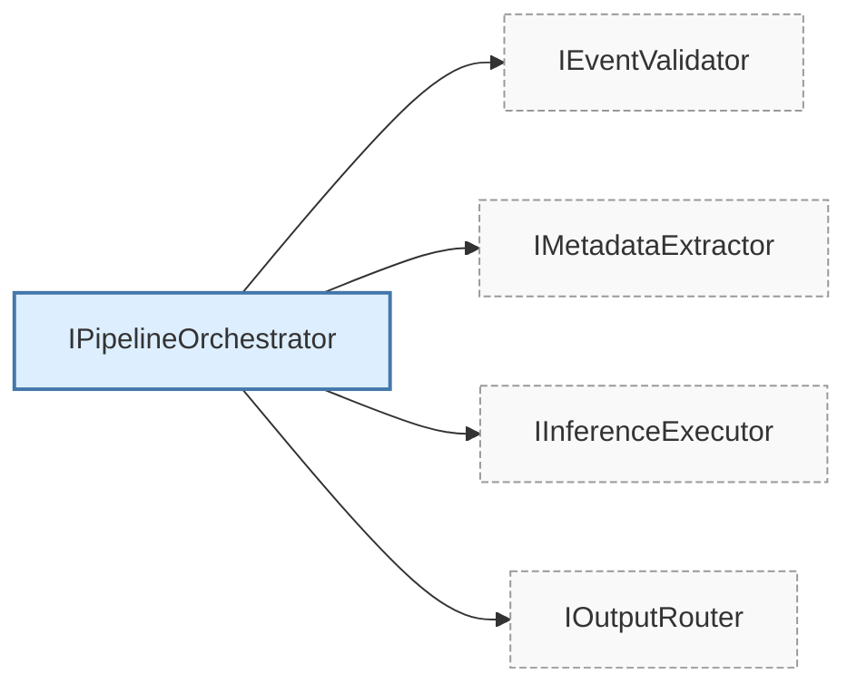

# Architecture Diagrams

## Minimal API Ingestion Flow



## Azure Functions - HTTP Trigger Flow

```mermaid
flowchart TD
    A[HTTP Trigger: HttpIngest] --> B[Read body + headers]
    B --> C[Create InferenceEvent]
    C --> D[IPipelineOrchestrator]
    D --> E[IEventValidator]
    E -->|Invalid| F[IOutputRouter -> Log warning]
    F --> G[Function HTTP Response (errors)]
    E -->|Valid| H[IMetadataExtractor]
    H --> I[IInferenceExecutor]
    I --> J[IOutputRouter -> Log info]
    J --> K[Function HTTP Response (success)]
```

## Azure Functions - Queue & Event Grid Triggers



## Application Layer Orchestrator (Interfaces)


